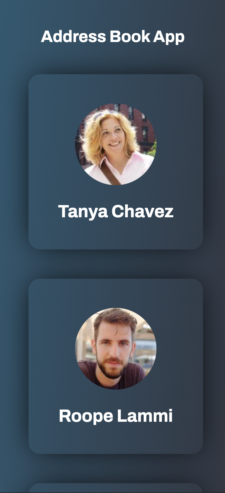

# Address Bok App

#### This project represents a address book app. This project has these considerations

1. Use of angular framework.
2. The integration of a good architecture of code following the best practices.
3. Creation of reusable components.
4. For the creation of the layouts the main css focuses were flexbox and grid.
5. The website is completely responsive and has been though for mobile devices as well.
6. The project follows the design at high level.
7. There is a home page where an initial request gets 10 random users, the app routing module is used to handle all the routes in the project.
8. With more time i would like to implement some unit tests.

## Run project

To run the project just do npm install to get all the dependencies and run npm start

## Deployment

The project has been deployed to this link: [vue project](https://address-book-roan-ten.vercel.app/home).

## Screenshots

These are some images from the project:

### Desktop

### Mobile

